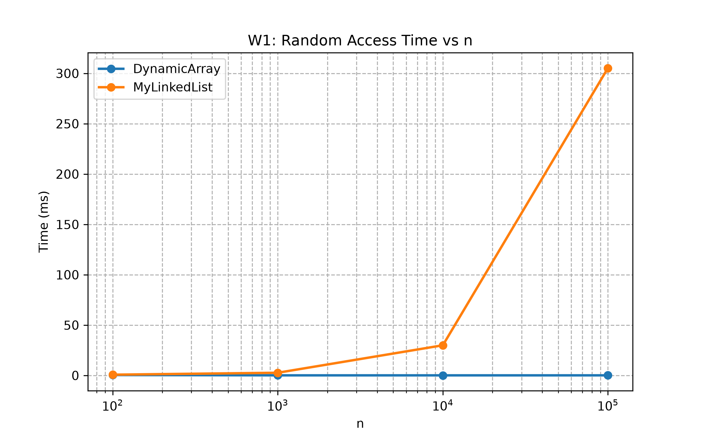
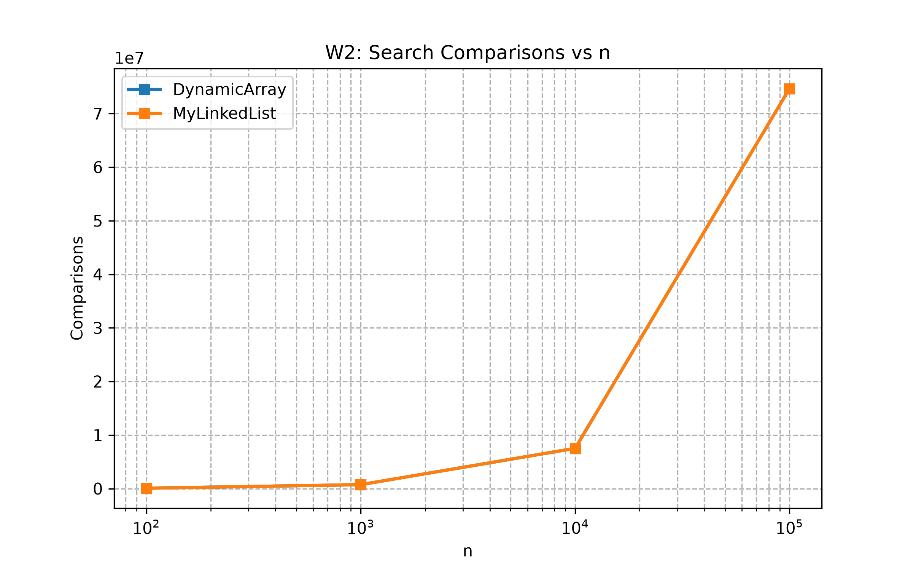
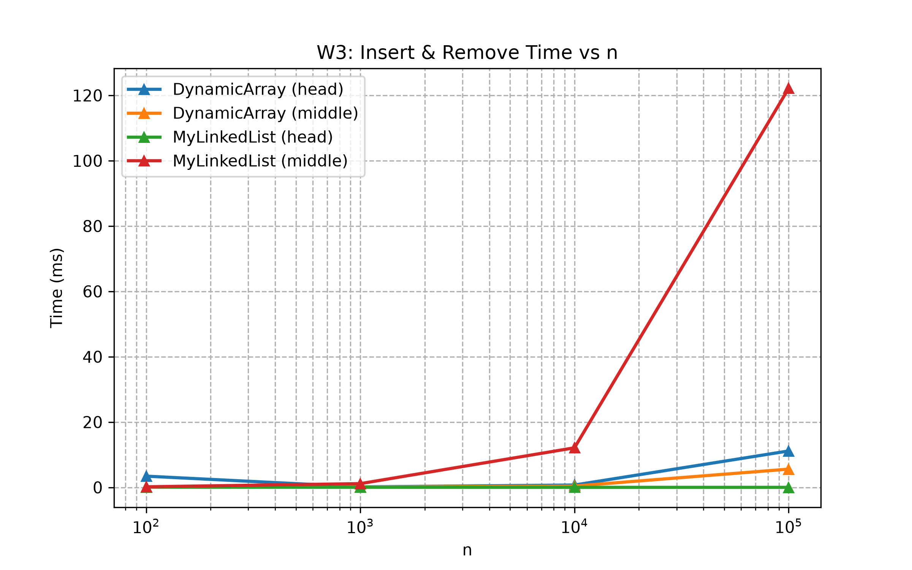
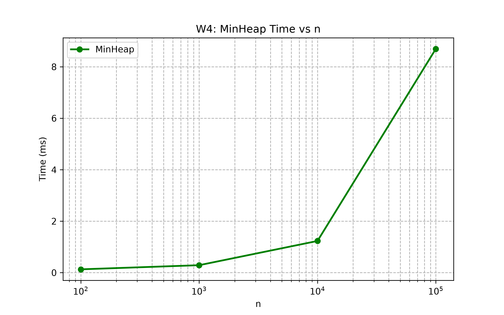

# Design and Analysis of Algorithms: Assignment 2 Report
**Student:** Akzhigit Agabekov  
**Group:** SE-2523

---

## 1. Asymptotic Complexity Table

| Structure | Operation | Best | Average | Worst | Space | Justification |
| :--- | :--- | :--- | :--- | :--- | :--- | :--- |
| **DynamicArray** | `get(i)` | $\Theta(1)$ | $\Theta(1)$ | $\Theta(1)$ | $\mathcal{O}(1)$ | Direct index access |
| **DynamicArray** | `add(x)` | $\Theta(1)$ | $\Theta(1)$ | $\Theta(n)$ | $\mathcal{O}(1)$ | Amortized $\mathcal{O}(1)$, worst on resize |
| **DynamicArray** | `add(i, x)` | $\Theta(1)$ | $\Theta(n)$ | $\Theta(n)$ | $\mathcal{O}(1)$ | Requires element shifting |
| **DynamicArray** | `remove(i)` | $\Theta(1)$ | $\Theta(n)$ | $\Theta(n)$ | $\mathcal{O}(1)$ | Requires left-shifting elements |
| **DynamicArray** | `contains(x)`| $\Theta(1)$ | $\Theta(n)$ | $\Theta(n)$ | $\mathcal{O}(1)$ | Linear scan |
| **MyLinkedList** | `get(i)` | $\Theta(1)$ | $\Theta(n)$ | $\Theta(n)$ | $\mathcal{O}(1)$ | Traverses nodes from head/tail |
| **MyLinkedList** | `add(x)` | $\Theta(1)$ | $\Theta(1)$ | $\Theta(1)$ | $\mathcal{O}(1)$ | Direct tail pointer insertion |
| **MyLinkedList** | `add(i, x)` | $\Theta(1)$ | $\Theta(n)$ | $\Theta(n)$ | $\mathcal{O}(1)$ | Node traversal to index $i$ |
| **MyLinkedList** | `remove(i)` | $\Theta(1)$ | $\Theta(n)$ | $\Theta(n)$ | $\mathcal{O}(1)$ | Node traversal to index $i$ |
| **MyLinkedList** | `contains(x)`| $\Theta(1)$ | $\Theta(n)$ | $\Theta(n)$ | $\mathcal{O}(1)$ | Linear traversal |
| **MinHeap** | `insert(x)` | $\Theta(1)$ | $\mathcal{O}(\log n)$| $\mathcal{O}(\log n)$| $\mathcal{O}(1)$ | Tree height bounded by $\log n$ |
| **MinHeap** | `peekMin()` | $\Theta(1)$ | $\Theta(1)$ | $\Theta(1)$ | $\mathcal{O}(1)$ | Root access at index 0 |
| **MinHeap** | `extractMin()`| $\Theta(1)$ | $\mathcal{O}(\log n)$| $\mathcal{O}(\log n)$| $\mathcal{O}(1)$ | `bubbleDown` along tree height |

---

## 2. Loop Invariant Proofs

### Proof 1: `contains(int x)` in `DynamicArray`
* **Invariant:** At iteration $i$, element $x \notin \text{data}[0 .. i-1]$.
* **Init:** At $i = 0$, slice is empty, invariant holds.
* **Maint:** If $\text{data}[i] \neq x$, loop proceeds to $i+1$, so $x \notin \text{data}[0 .. i]$.
* **Term:** At $i = \text{size}$, element $x$ is not in the array, returns `false`.

### Proof 2: `bubbleDown(int index)` in `MinHeap`
* **Invariant:** Min-Heap property holds everywhere except possibly at `index`.
* **Init:** Swapping root with last leaf breaks property only at root (`index = 0`).
* **Maint:** Swapping `index` with smaller child fixes `index` and moves violation down.
* **Term:** Stops when `index` has no children or is $\le$ children. Property fully restored.

---

## 3. Empirical Results & Charts

### Workload 1: Random Access (`W1`)

### Workload 2: Search (`W2`)

### Workload 3: Insert & Remove (`W3`)

### Workload 4: Priority Processing (`W4`)

---

## 4. Performance Discussion

1. **Spatial Locality:** `DynamicArray` uses contiguous memory, maximizing CPU cache line hits and outperforming `MyLinkedList`.
2. **Pointer Chasing:** `MyLinkedList` nodes cause cache misses and extra memory overhead due to object headers and references.
3. **Recommendations:** Use `DynamicArray` for general access, `MyLinkedList` for head/tail edits, and `MinHeap` for priority tracking.